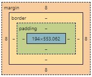

# Web 구성 요소

## HTML(Hyper Text Markup Language)

웹을 이루는 가장 기초적인 구성 요소로, 웹 콘텐츠의 의미와 구조를 정의하는 마크업 언어이다.

## CSS(Cascading Style Sheets)

웹 페이지의 모양과 표현을 할때 사용한다.

## JavaScript

웹 페이지 콘텐츠의 기능, 동작을 설명, 구현할 때 사용한다.

## HTML
>HTML 코드 예시는 1.index.html 참고
### HTTP(Hyper Text Transfer Protocol)

WWW(World Wide Web) 상에서 정보를 주고받을 수 있는 프로토콜이다. 주로 HTML 문서를 주고 받는 데에 쓰인다.
클라이언트와 서버 사이에 이루어지는 요청/응답 프로토콜이다. 클라이언트와 서버 사이의 소통은 ASCII 메시지를 통해 이루어지고, 메시지는 대표적으로 `GET`,`POST`가 있다. 메시지는 `<CR><LF>`(carriage return, line feed)로 끝나야한다.

### HTML 요소

```html
<p class="editor-not">Hello world</p>
```

HTML 코드는 요소들로 이루어져있고, 열고 닫는 태그와 내용으로 이루어져있다.
태그에는 속성을 부여할 수 있는데, `속성명=속성값`의 형태로 속성을 부여한다.
여러개의 속성을 부여할 수도 있다. 여러개의 속성을 사용할 때는 각 속성 사이에 띄어쓰기로 구분한다.

#### Head, Body

HTML 구성중 Head에는 문서 정보를 포함시키고, 웹 화면에 나타나는 정보를 포함시킨다.

### tag

#### 기본적인 태그

- `<h1>제목</h1>` : 제목을 포함하기 위한 태그 (h뒤 1~6 숫자를 입력해 header의 중요도 표시)
- `<p>문단</p>` : 문자의 문단을 포함하기 위한 태그 
- `<a href="url" target="_blank">링크제목</a>` : 하이퍼링크를 포함하기 위한 태그
- `` : 이미지를 포함하기 위한 태그
- `<ul><li>순서없는리스트</li></ul>` : 리스트를 포함하기 위한 태그 (순차리스트는 ul 대신 ol)
- `<table><tr><th>열제목</th></tr><tr><td>값</td></tr></table>` : 표를 포함하기 위한 태그

#### Form
>form 코드 예시는 2.form.html, 3.subway_form.html을 참고

```html
<form>
    <input type="text" id="input_id" name="input_name">
    <label for="input_id">라벨이름</label>
</form>
```
사용자로부터 정보를 입력 받을 때 `form` 태그를 통해 폼을 포함시킨다.

`input` 태그를 통해 사용자로부터 정보를 입력받는다.
- `type` : text(문자열), submit(제출), checkbox(선택), password(대체표시)등으로 입력데이터 형식을 정한다.
- `id` : `input`의 고유 id를 지정한다.
- `name` : `input`으로 입력받은 값의 변수명을 지정한다.

`label` 태그를 통해 `input` box 앞에 라벨을 표시한다.
- `for` : 라벨을 표시할 `input id`를 지정한다.

### Formating

- `<b>` : bold
- `<strong>` : important (웹에서 더 중요하게 인식) (sementic tag)
- `<i>` : italic
- `<em>` : emphasized
- `<mark>` : marked
- `<small>` : smaller
- `<del>` : deleted
- `<ins>` : inserted
- `<sub>` : subscript
- `<sup>` : superscript

### 기타

#### Lorem

`Lorem<num>`<br>
`Lorem`을 입력하고 뒤에 숫자를 입력하면 그 숫자만큼 단어를 가진 더미 데이터를 생성한다.


## CSS
>css 코드 예시는 4.css.html, mystyle.css 참고
### Box model

<br>
- border : 테두리
- margin : 테두리 밖의 영역
- padding : 테두리 안의 영역

### CSS ruleset

```CSS
p {
    color: red;
}
```
`p`와 같은 selector(선택자)에 해당하는 모든 태그 요소의 속성값을 정한다.
속성은 `속성명: 속성값`을 통하여 선언한다.

selector를 `p`태그의 특정 id로 하는 ruleset의 경우 `p` 대신 `p#id_name` 을 통하여 selector를 지정한다.
selector를 `p`태그의 특정 class로 하는 ruleset의 경우 `p` 대신 `p.class_name` 을 통하여 selector를 지정한다.
selector를 `p`태그의 속 태그로 하는 ruleset의 경우 `p` 대신 `p > tag_name` 을 통하여 selector를 지정한다.

### 기타

#### font/icon 참고 사이트
>각 사용 방법은 4.css.html 참고

<a href="fontawesome.com">fontawesome</a><br>
<a href="fonts.google.com">fonts.google</a>

# 참고

더 자세한 내용은 다음 사이트 참고
<a href="https://www.w3schools.com">w3schools</a><br>
<a href="https://www.developer.mozilla.org/ko">MDN</a><br>
